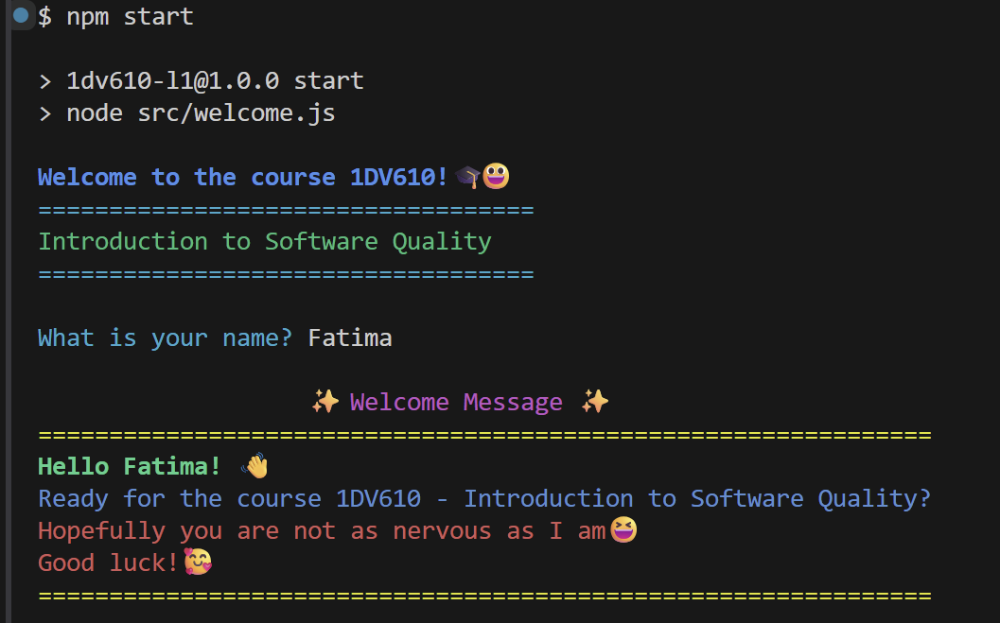

## Laboratory 1

### Description
A simple welcome program that is created for Laboratory 1 in the course 1DV610 - Introduction to Software Quality. The user enters their name and receives a friendly greeting and a little bit of encouragement.

#### Installation
npm install

#### Run the program
npm start

#### Example Output

